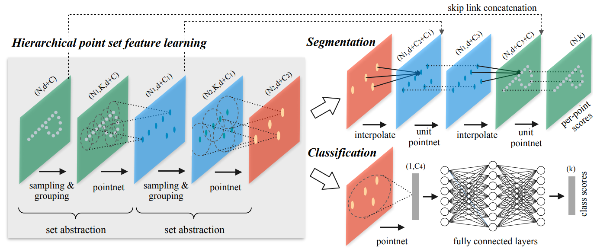
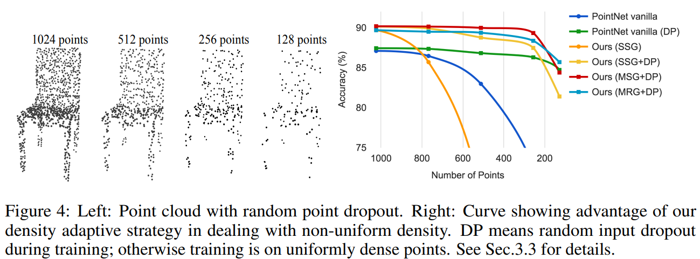
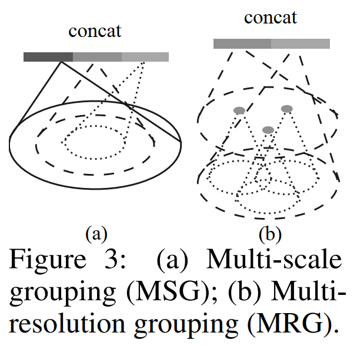
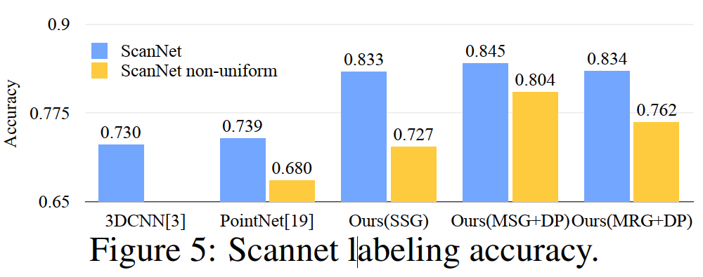
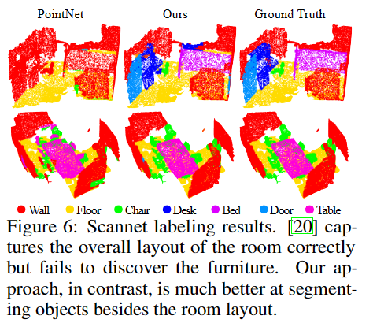

# PointNet笔记

主要参考：[第1章：3D点云应用领域分析：1-点云数据概述_哔哩哔哩_bilibili](https://www.bilibili.com/video/BV11C4y1q7Pu?p=1&vd_source=bf7b9535de982f1d288138463991a3f7)

## 点云

应用领域分割、补全、生成、检测、配准（为下游任务服务）

如何做？

PointNet关键：backbone？

### 数据来源

激光雷达

深度相机

.txt文件数据格式：x,y,z,Nx,Ny,Nz

### 点云数据特性

无序性

近密远疏

非结构化数据，无法直接CNN

关键：如何进行特征提取

但深度学习核心思想就是端到端(End2End)一条龙

## PointNet(2017)

论文：PointNet: Deep Learning on Point Sets for 3D Classification and Segmentation  

### 基本出发点

无序性带来的置换不变性（用max函数体现）

但max函数损失特征太多

故考虑先升维（神经网络的隐层，如卷积或全连接）再做max操作

### 基本模型架构

分别对每个点进行特征提取（卷积或全连接），再MAX得到全局进行输出

上面是分类网络

点的数量2048x6

maxpooling相当于torch.max操作

下面是分割网络

nx64拿出来和全局特正复制后做拼接得到nx1088

### PointNet存在问题

少了局部特征融合

没有关系概念

然后有了PointNet++,主要就是从局部入手，利用局部特正

在特正提取出使用类似图卷积的方式来整合特征

## PointNet++

论文：PointNet++: Deep Hierarchical Feature Learning on Point Sets in a Metric Space  

### 基本出发点

基于半径选择局部区域（类似得到很多个簇）

针对每个区域进行特征提取（卷积）

待解决的问题：如何**选择区域**（簇中心的选择）

簇的半径大小如何定义，每个簇中选择多少个样本点

第一步先确定每一个局部区域，接下来对局部区域执行PointNet

### **最远点采样**(farthest point sampling)

为了**尽可能覆盖全局**

例如输入1024个点，要选择128个中心点（簇），如何采样？

具体就是先算与已采样点最近的当作距离再比较不同距离，用最远的距离当下一个采样点，如下图，俩绿点d1<d2选d2的绿点,俩黑点选d3的黑点

### 分组（gouping）

例如：输入为batch * 1024 *6(1024个点，每个点对应3个坐标3个法向量信息)

如何控制组内点数一致：

​		少点：复制离当前中心最近的点，复制到每个圈的点都一样

​		多点：按距离排序然后舍去

分组后输出为：batch* 128 *16 *6(128个中心点，每个簇16个样本)，关键是理解128 * 16是怎么来的（多点少点的情况处理）

实际计算时是**选择多种半径**，多种样本点个数，目的是特正更丰富

例如：半径=（0.1，0.2，0.4）;对应簇的样本个数（16,32,64）

### 整体流程概述

对各组进行特征提取：

先进行维度变换（b * npoints * nsample * features , 8 * 128 * 16 * 6 -> 8 * 6 * 16 * 128）,原因：pytorch 需要channel first

进行卷积操作（例如:in=6 , out =64）就得到提取的特正(8 * 64 * 16 * 128)，相当于pointnet的升维

注意当前每个簇都是16个样本点，我们要每一个簇对应一个特征

按照pointnet,做MAX操作，得到8  * 64 * 128 ,8是batch ，128是簇的数量，每个簇有64维特征

继续做多次采样，分组，卷积：

例如：采样中心点（1024->512->128）

每一次操作时，都要进行特征拼接（无论半径维0.1，0.2，0.4；以及簇采样点个数）

最终都得到batch* 中心点个数 * 特征（特征个数可能不同）

执行拼接操作(b*512 * 128 , b* 512 *256, b * 512 *  512) -> (b* 512 * 896)，对特征维度上做拼接

### 分类网络整体架构

经过多次采样，分组，pointnet得到最终整体特征，再进行分类

前面是特征提取网络，右下是利用特征做全连接进行k分类

### 分割网络整体架构

如上图右上，特征提取网络不变

分割任务需要得到每个点的特征，还需要进行上采样操作，做插值，有权重参数，利用距离分配权重，除了插值还需要拼接d+C2+C1，直到还原出原始特征，最后做全连接进行分类

### 遇到的问题

容易受样本点个数的影响，看右图橙色线，随着点数增加，准确率快速下降

#### 改进的设计

多半径进行特征拼接（MSG）或跨层来提取不同分辨率特征(MRG)

看上图4可知道，红线MSG整体效果好

### 实验效果

下图用于语义场景标记的点集分割，对语义场景标记任务进行了评估。目标是预测室内扫描中点的语义对象标签。 

