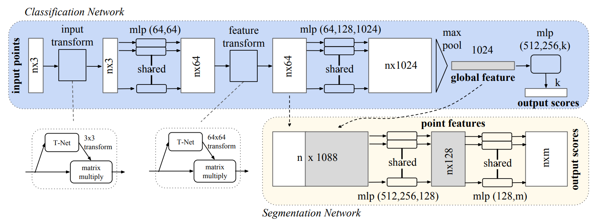
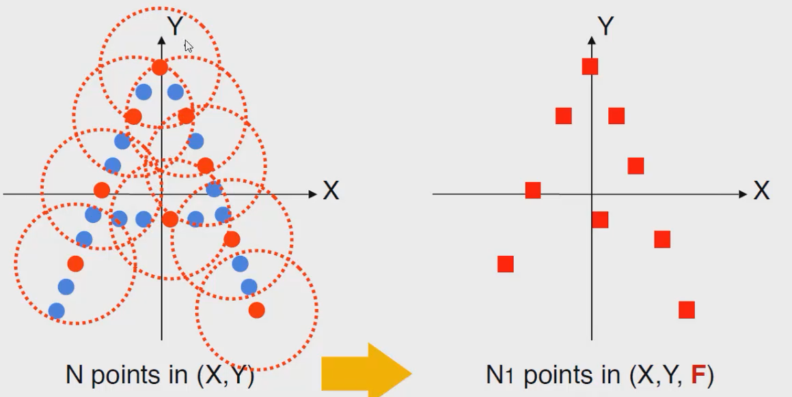
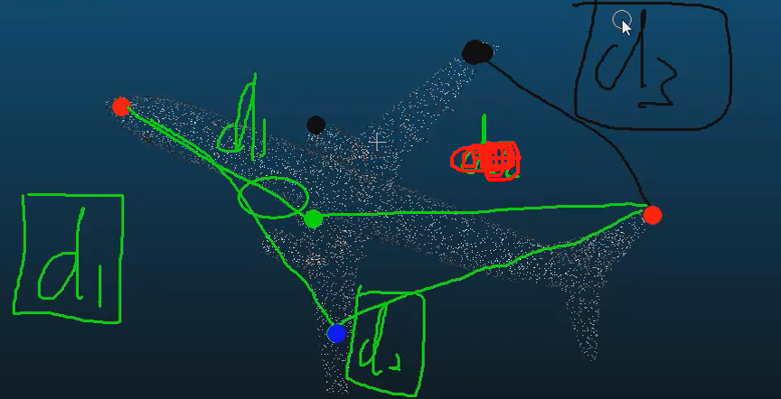

# PointNet笔记

## 点云

应用领域分割、补全、生成、检测、配准（为下游任务服务）

如何做？

PointNet关键：backbone？

### 数据来源

激光雷达

深度相机

.txt文件数据格式：x,y,z,Nx,Ny,Nz

### 点云数据特性

无序性

近密远疏

非结构化数据，无法直接CNN

关键：如何进行特征提取

但深度学习核心思想就是端到端(End2End)一条龙

## PointNet(2017)

### 基本出发点

无序性带来的置换不变性（用max函数体现）

但max函数损失特征太多

故考虑先升维（神经网络的隐层，如卷积或全连接）再做max操作

### 基本模型架构

分别对每个点进行特征提取（卷积或全连接），再MAX得到全局进行输出

上面是分类网络

点的数量2048x6

maxpooling相当于torch.max操作

下面是分割网络

nx64拿出来和全局特正复制后做拼接得到nx1088

### PointNet存在问题

少了局部特征融合

没有关系概念

然后有了PointNet++,主要就是从局部入手，利用局部特正

在特正提取出使用类似图卷积的方式来整合特征

## PointNet++

### 基本出发点

基于半径选择局部区域（类似得到很多个簇）

针对每个区域进行特征提取（卷积）

待解决的问题：如何**选择区域**（簇中心的选择）

簇的半径大小如何定义，每个簇中选择多少个样本点

第一步先确定每一个局部区域，接下来对局部区域执行PointNet

### **最远点采样**(farthest point sampling)

为了**尽可能覆盖全局**

例如输入1024个点，要选择128个中心点（簇），如何采样？

具体就是先算与已采样点最近的当作距离再比较不同距离，用最远的距离当下一个采样点，如下图，俩绿点d1<d2选d2的绿点,俩黑点选d3的黑点

### 分组（gouping）

例如：输入为batch * 1024 *6(1024个点，每个点对应3个坐标3个法向量信息)

如何控制组内点数一致：

​		少点：复制离当前中心最近的点，复制到每个圈的点都一样

​		多点：按距离排序然后舍去

分组后输出为：batch* 128 *16 *6(128个中心点，每个簇16个样本)，关键是理解128 * 16是怎么来的（多点少点的情况处理）

实际计算时是**选择多种半径**