# ROS学习笔记


## 关键组件

### Launch文件

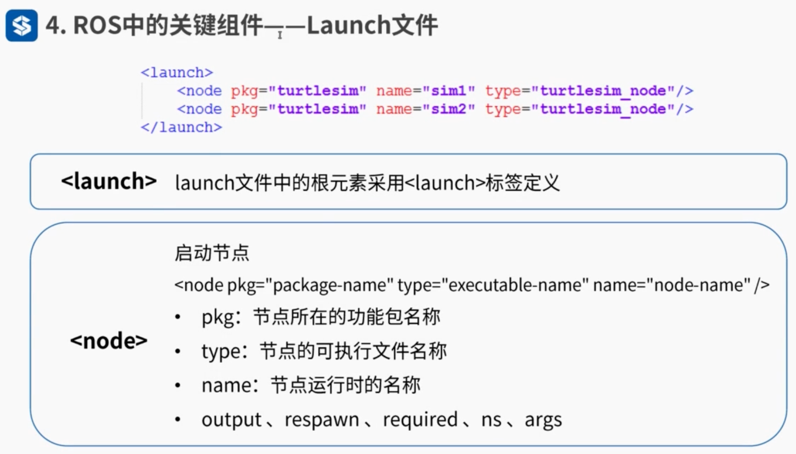

ns(namespace命名空间)

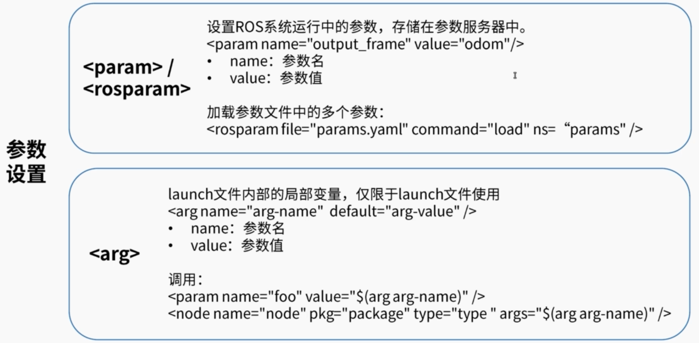

param是ROS整个参数服务器中使用，相当于全局变量

arg则仅在launch中使用

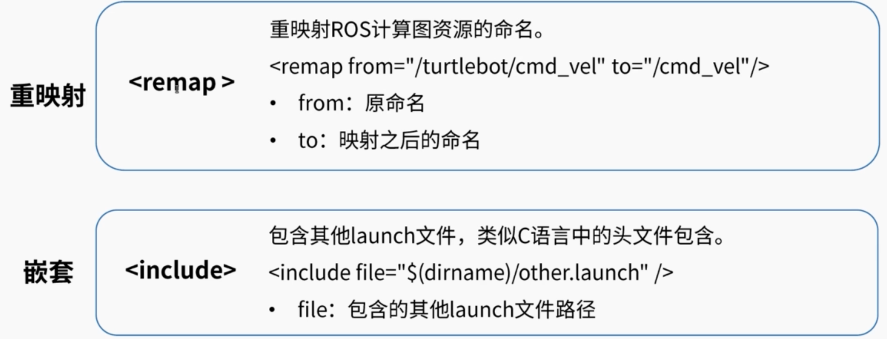

remap相当于把别人做好的功能包重命名，改别人的接口，但要小心，所有from的名称都会变成to后的名称，全局改变


### TF坐标变换

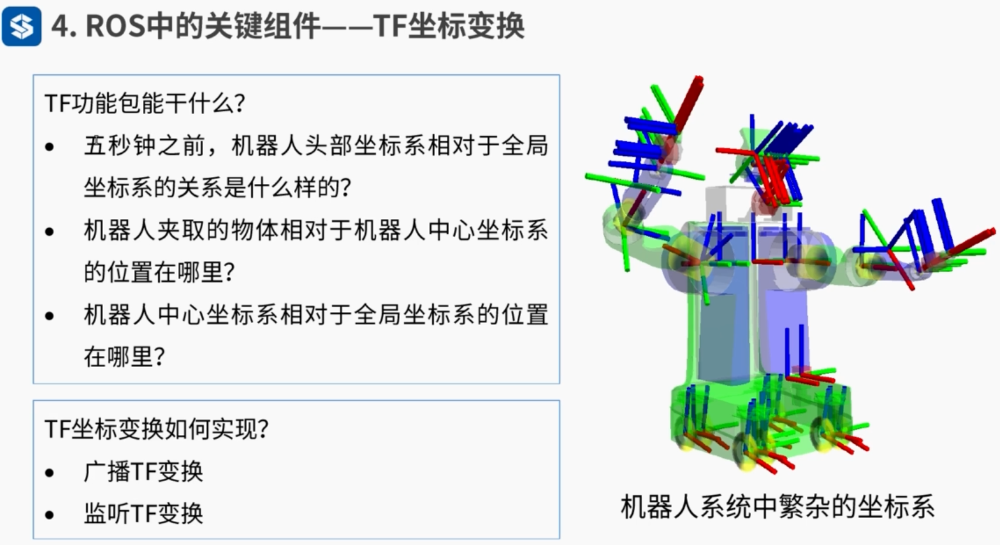

能保存10s的时间跨度

数据结构以树形结构保存

**tf功能包安装及例程：**

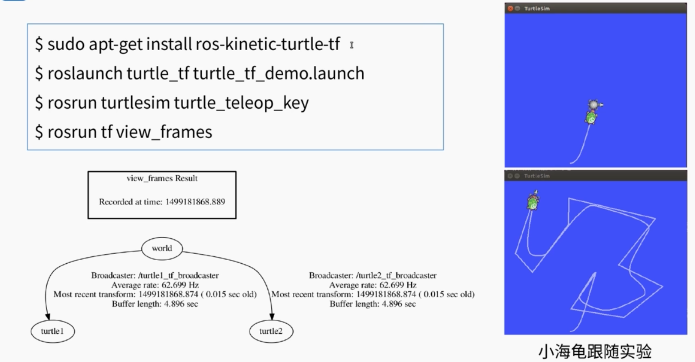

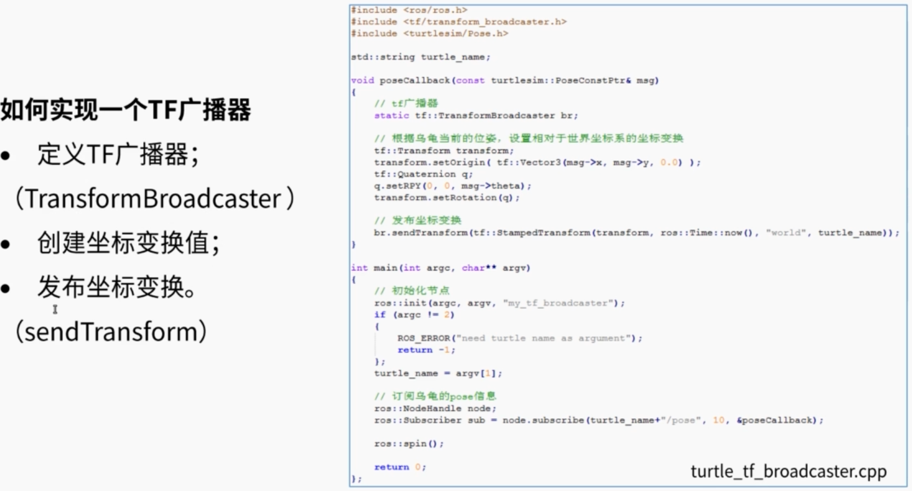

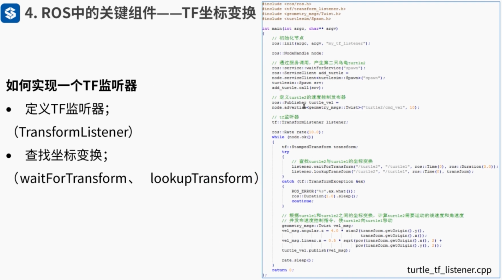

#### 编译代码部分

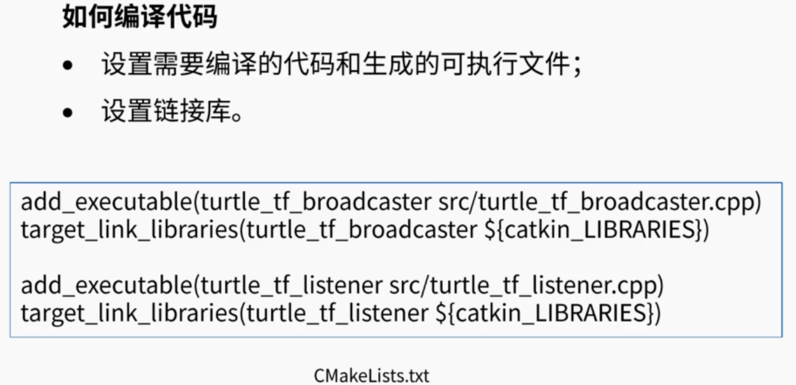


### QT工具箱

```
rqt_console 日志输出工具
rqt_graph 计算图可视化工具
rqt_plot 数据绘图工具
rqt_reconfigure 参数动态配置工具 
	运行方式: rosrun rqt_reconfigure
```

可以在终端输入rqt_然后TAB尝试其他工具

### Rviz可视化平台

可视化界面

Rviz插件机制

### Gazebo物理仿真环境

 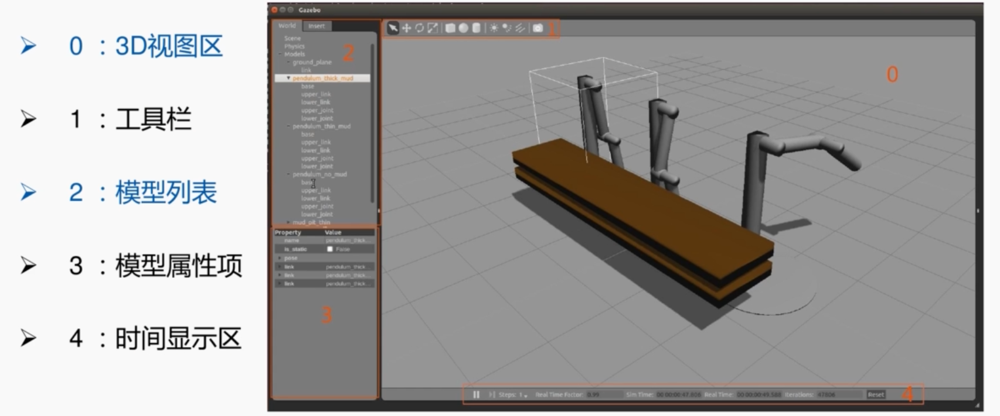

 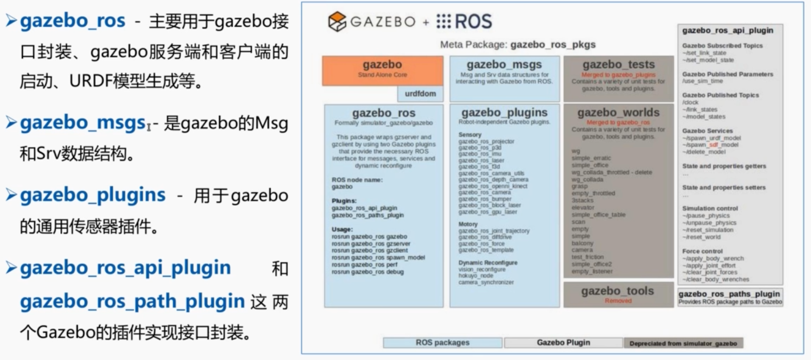


## 小结

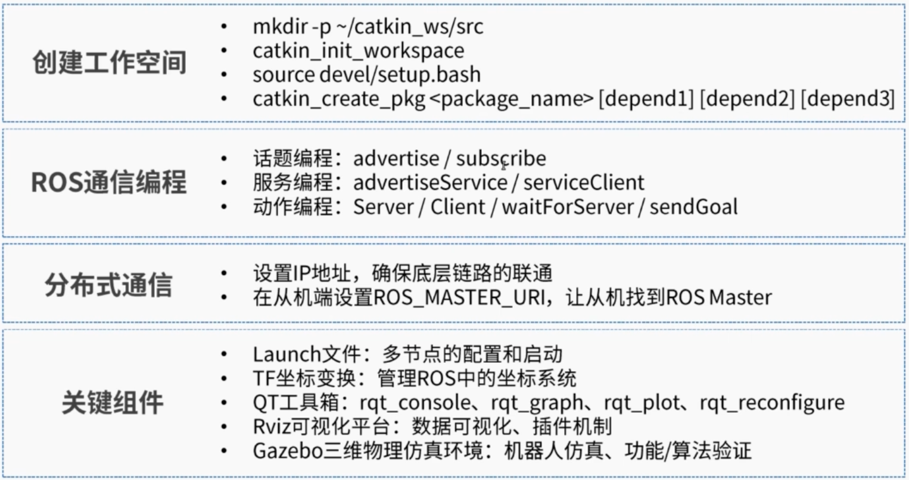