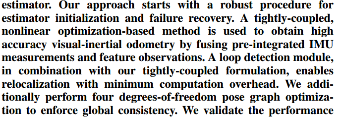

[TOC]

# VINS-mono

①我们的方法从一个用于估计器初始化和故障恢复的鲁棒过程开始。

②采用一种紧密耦合、基于非线性优化的方法，通过融合预积分的IMU测量和特征观测，获得高精度的视觉惯性里程计。

③一个回环检测模块，结合紧密耦合公式，能够以最小的计算开销重新定位。

④执行了四自由度姿态图优化，以加强全局一致性。

[SfM、VO和SLAM介绍_NieBP的博客-CSDN博客_sfm图像处理](https://blog.csdn.net/weixin_43891708/article/details/121594043)

在自动驾驶地图定位模块的功能开发中，主要研究方向分为三种：建图、里程计、定位。**SfM**（Structure From Motion）即 传统三维重建，它更注重的是建图；**VO**（Visual Odometry）或**VIO**（Visual-Inertial Odometry）要解决的问题就是里程计问题，与机器人领域不同，在实际自动驾驶项目中，里程计部分是由惯导，轮速计，视觉，激光等多传感器融合完成；**SLAM**（Simultaneous Localization And Mapping）同时建图与定位，它更注重的是定位。

