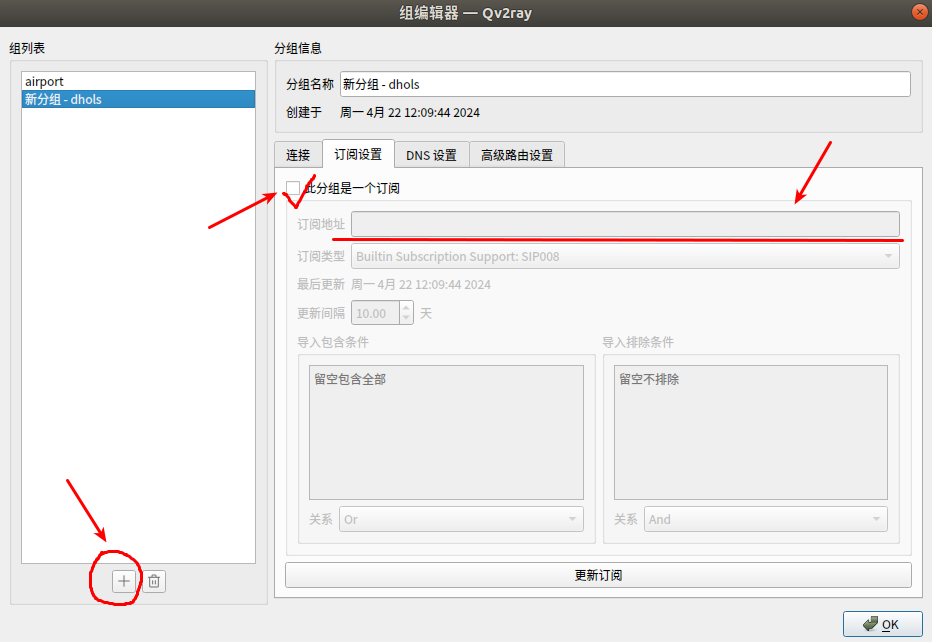
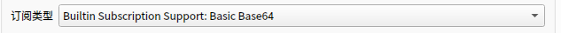
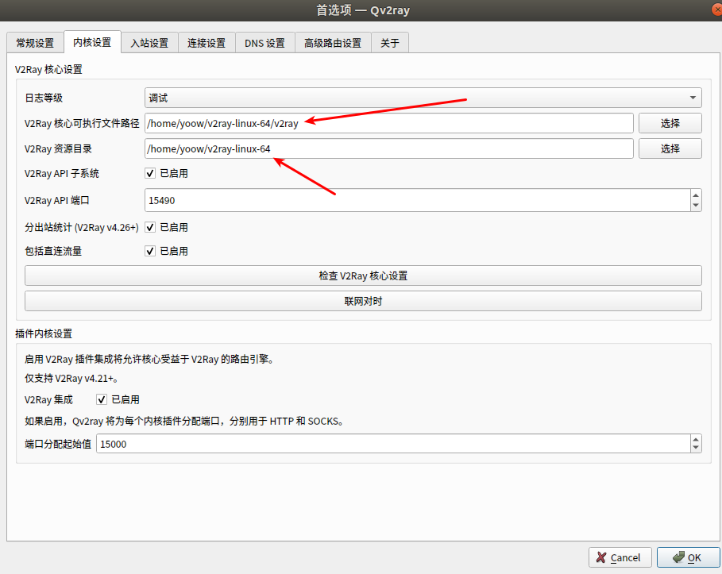

# Linux配置Qv2ray

下载旧版本的v2ray-core（新版本不兼容，会出现核心文件错误）

https://github.com/v2fly/v2ray-core/releases/tag/v4.44.0

根据系统选择下载Appimage，

https://github.com/Qv2ray/Qv2ray/releases/tag/v2.7.0

点击分组，新建分组，输入订阅地址，修改订阅类型，然后更新订阅。

进入首选项，按照下载的v2ray-core设置可执行文件的路径和资源目录

