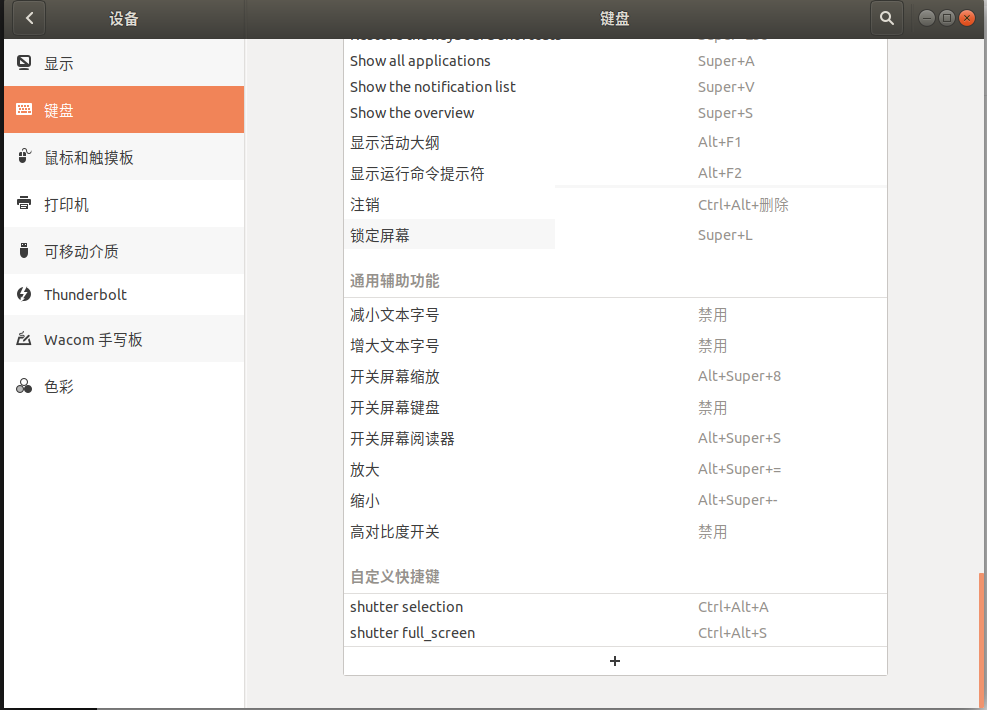
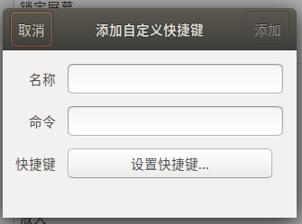

# Shutter 使用

## 安装截图软件shutter

```javascript
sudo apt install shutter    #安装shutter
```

然后配置快捷键，快捷键的命令 shutter -s 是新建一个截图

在Ubuntu 18.04中安装了我最喜欢的截图工具Shutter后，我发现编辑按钮变编程灰色。这个快速提示将向您展示如何重新启用Shutter中的编辑功能。 libgoocanvas-common：https://launchpad.net/ubuntu/+archive/primary/+files/libgoocanvas-common_1.0.0-1_all.deb libgoocanvas3：https://launchpad.net/ubuntu/+archive/primary/+files/libgoocanvas3_1.0.0-1_amd64.deb libgoo-canvas-perl：https://launchpad.net/ubuntu/+archive/primary/+files/libgoo-canvas-perl_0.06-2ubuntu3_amd64.deb

```javascript
sudo dpkg -i libgoocanvas-common*.deb
sudo dpkg -i libgoocanvas3*.deb
sudo dpkg -i libgoo-canvas-perl*deb
```

将上述三个包给安装上，若安装失败，执行下面代码:

```javascript
sudo apt install -f
```

然后再安装这几个包。 重启！重启！重启！重要的事情说三遍！


## 快捷键设置

在应用程序中找到键盘，拉到最下找到自定义快捷键



按加号



输入命令，并设置快捷键，自定义名称即可

**全屏截图**：

```
shutter -f
```

**选择区域截图**：

```
shutter -s
```


进入shutter 选择编辑->首选项 可设置截图后的操作