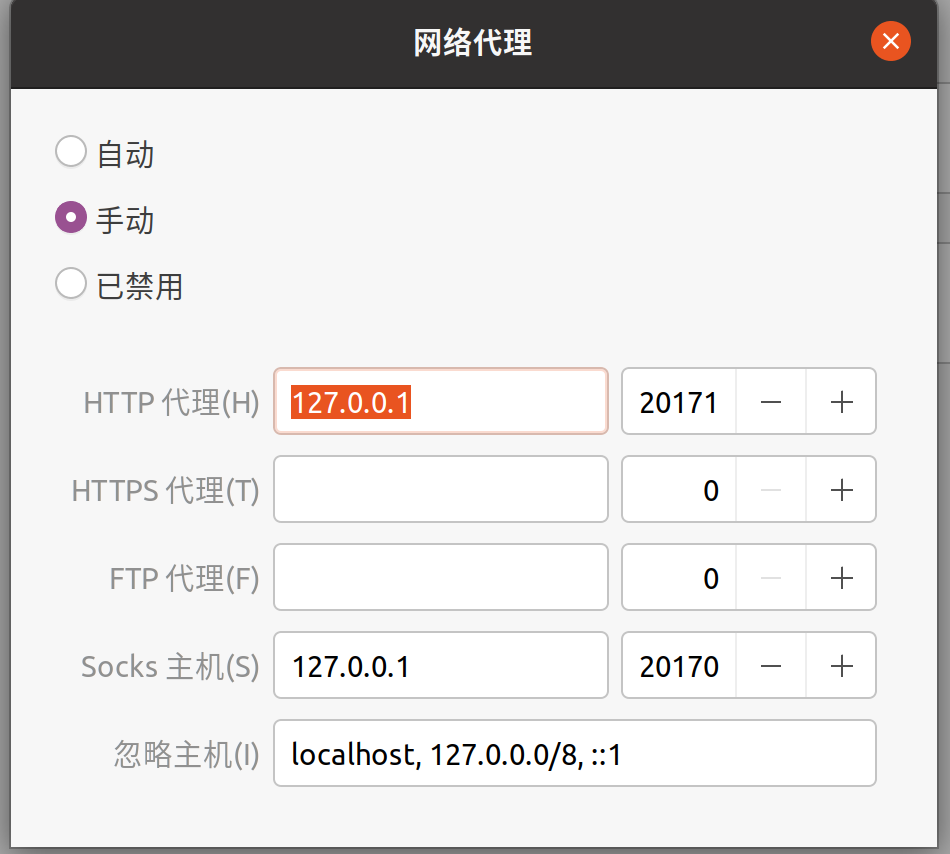

# v2rayA翻墙使用

下载v2rayA:https://github.com/v2rayA/v2rayA/releases

选择[installer_debian_x64_2.2.5.8.deb](https://github.com/v2rayA/v2rayA/releases/download/v2.2.5.8/installer_debian_x64_2.2.5.8.deb)

运行

```
sudo dpkg -i installer_debian_x64_2.2.5.8.deb
```

下载安装v2ray-core :https://github.com/v2fly/fhs-install-v2ray

```
git clone https://github.com/v2fly/fhs-install-v2ray.git
```

进入文件夹

```
cd fhs-install-v2ray
```

安装

```
bash install-release.sh
```

使用方法：

```
sudo v2raya
```

进入网页

http://127.0.0.1:2017/

导入配置

```
vmess://ewogICJ2IjogIjIiLAogICJwcyI6ICJjbFZNIiwKICAiYWRkIjogIjEzNC4xOTUuMjExLjE3IiwKICAicG9ydCI6IDEzNjYxLAogICJpZCI6ICJjZGI1MDdmMS01YWQ5LTQ1NTktYjliNC02YzM5YWUwYjQxMDgiLAogICJuZXQiOiAid3MiLAogICJ0eXBlIjogIm5vbmUiLAogICJob3N0IjogIiIsCiAgInBhdGgiOiAiLyIsCiAgImF1dGhvcml0eSI6ICIiLAogICJ0bHMiOiAibm9uZSIsCiAgInNuaSI6ICIiLAogICJmcCI6ICIiCn0=
```

点击SERVER选择节点

左上角运行该节点


浏览器使用扩展[SwitchyOmega](chrome-extension://fdbloeknjpnloaggplaobopplkdhnikc/options.html#!/about) ,从备份文件恢复

链接: https://pan.baidu.com/s/1qu7j6mITuwpbaCUIRthlHw?pwd=1234 提取码: 1234 

选择情景模式：auto switch


法2：

系统设置选择网络——>网络代理，



