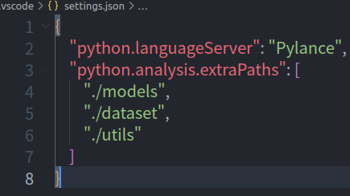

# 解决VScode python 未找到定义 未找到引用 无法跳转

1.ctrl +shift +p
2.输入setting
3.找到首选项：打开工作区设置（JSON）


在工作区设置的settings.json文件中加入

```text
"python.languageServer": "Pylance"
```

发现有的函数仍旧不能跳转，加入具体路径（也可尝试用vscode自动修复）

```
 "python.analysis.extraPaths": [
        "./models",
        "./dataset",
        "./utils"
    ]
```

最后代码如下，可实现项目内代码跳转

