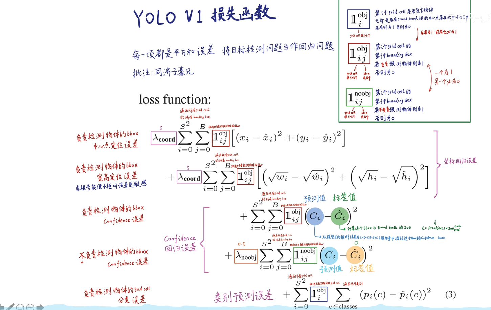
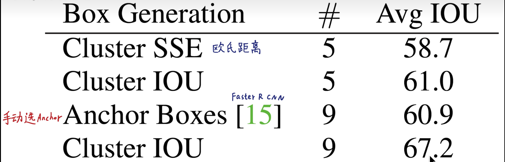
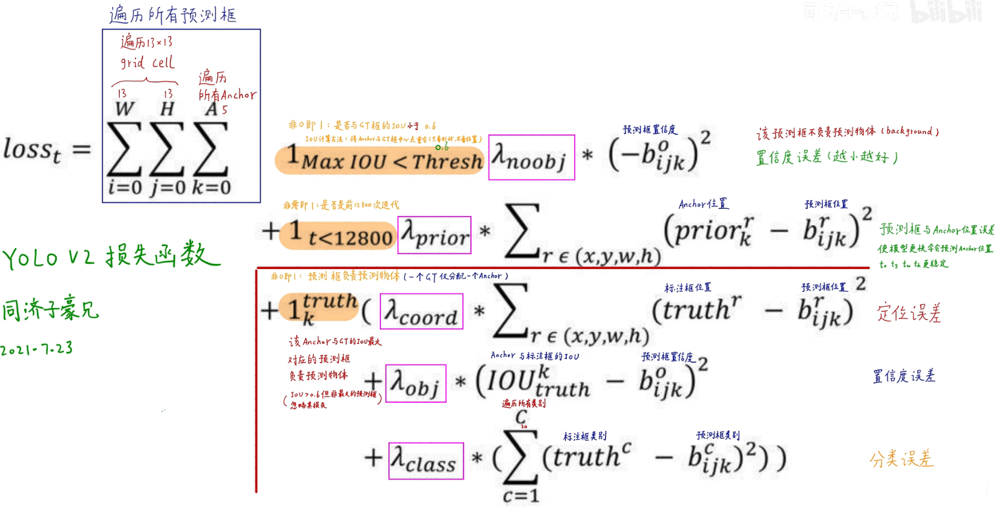
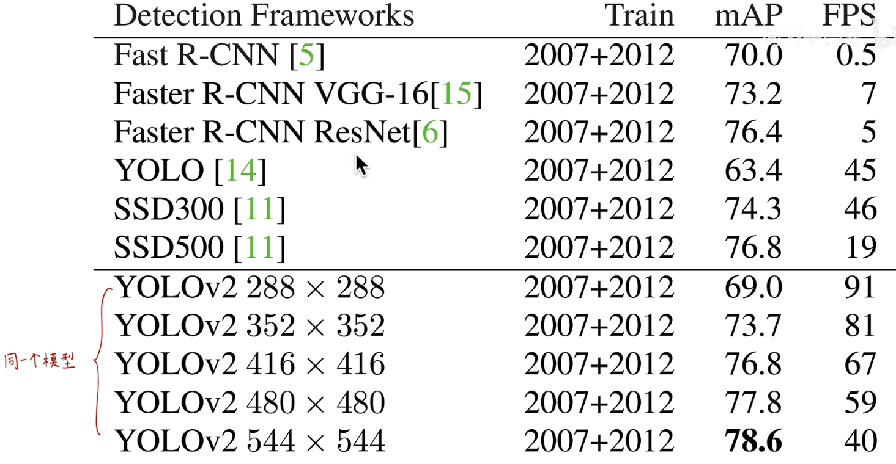
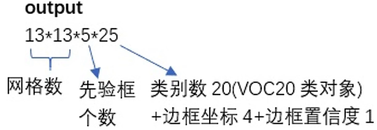
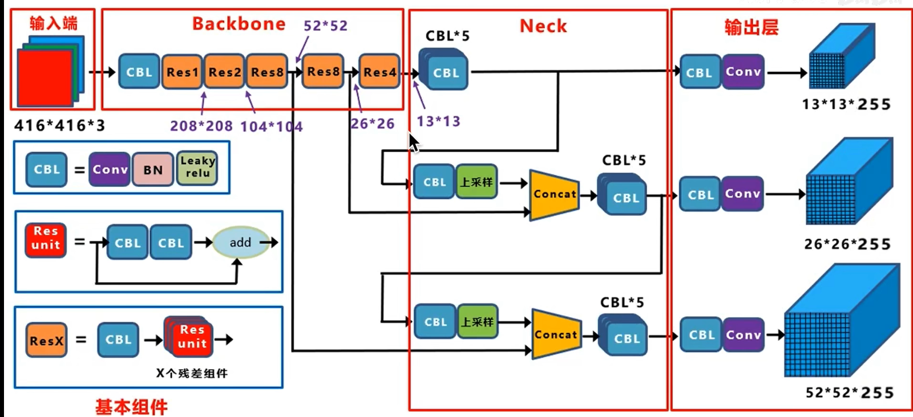
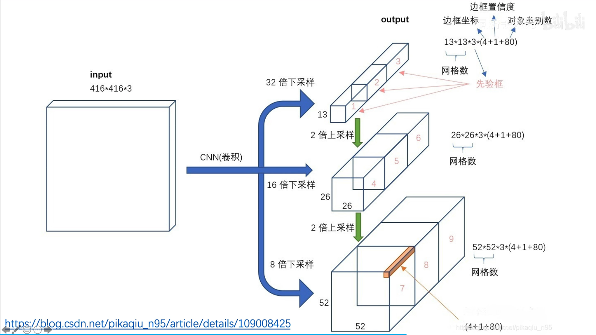
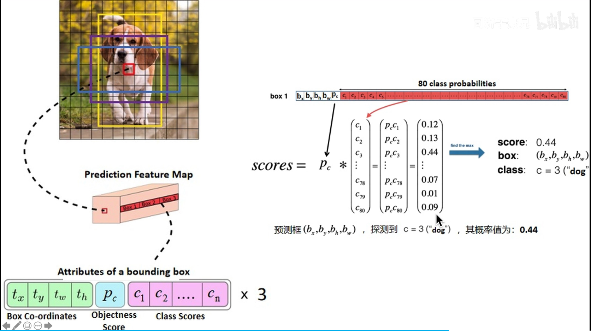
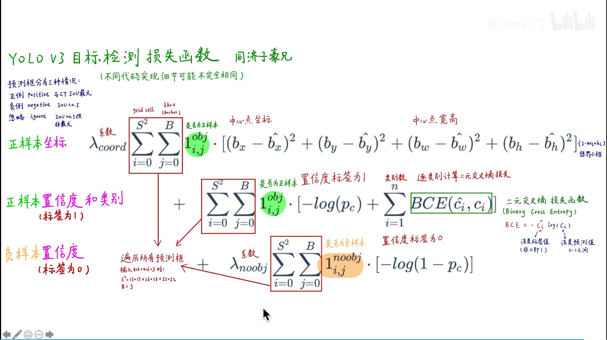

# YOLO笔记

## YOLOV1 

将分类预测问题变成回归问题,两阶段简化到单阶段，

### 预测过程

grid cell  、 IOU 、  NMS

每个俩个BBX

### 训练过程

### 损失函数

输入448 * 448 * 3

输出7 * 7 * 30

## YOLOv2    YOLO9000

### BN

### Anchor Dimension Clusters

使用5个anchor，预先设定好长宽比的框

### 损失函数

### 不同操作的效果

### 大图片效果更好

### 改进了网络结构 

darknet19

输入416 * 416 * 3

输出13 * 13 * 5 * 25

## YOLOv3

### 算法框架

与YOLOv2不同，此处是pc相乘之后才是confidence

### 损失函数

