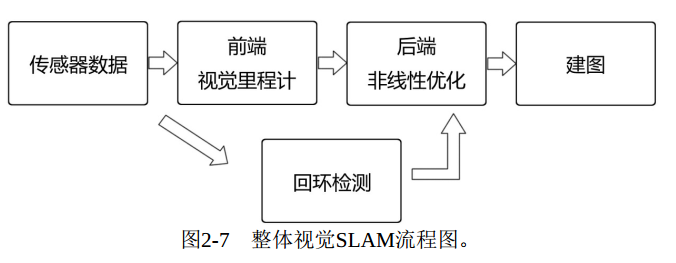
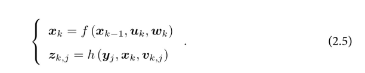
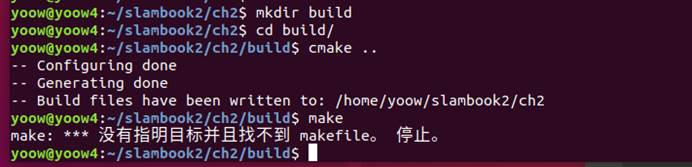
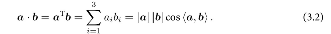
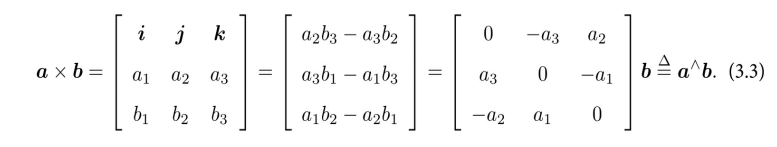
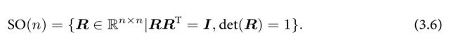
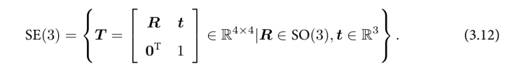
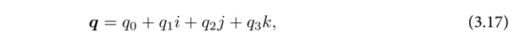
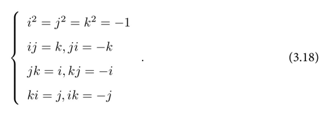
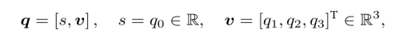

[TOC]


# 视觉SLAM十四讲学习笔记

# 第二讲：初识SLAM

https://www.bilibili.com/video/BV1Xr4y1F7Zi/?spm_id_from=333.788.videocard.5

**机器人探索一个房间要解决的问题：**

1.我在什么地方？ ——定位。
2.周围环境是什么样？ ——建图。  

**视觉SLAM**：用相机解决建图和定位的问题


①**单目相机**：通过图像运动形成的视差，可判断物体离的远近。

轨迹估计与真实地图相差一个真实尺度（即物体大小），具有尺度不确定性。

②**双目**：两个相机之间的距离〔称为基线（Baseline） 〕 是已知的。 我们通过这个基线来估计每个像素的空间位置。

③**深度（RGB-D）**:通过红外结构光或Time-of-Flight（ToF） 原理,像激光传感器那样,通过主动向物体发射光并接收返回的光， 测出物体与相机之间的距离。  


## SLAM框架




1.传感器信息读取。 在视觉SLAM中主要为相机图像信息的读取和预处理。 如果是在机器人中， 还可能有码盘、 惯性传感器等信息的读取和同步。
2.**视觉里程计（Visual Odometry， VO）** 。 视觉里程计的任务是估算相邻图像间相机的运动， 以及局部地图的样子。 VO又称为前端（Front End） 。
3.**后端优化（Optimization）** 。 后端接受不同时刻视觉里程计测量的相机位姿， 以及回环检测的信息， 对它们进行优化， 得到全局一致的轨迹和地图。 由于接在VO之后， 又称为后端（Back End） 。
4**.回环检测（Loop Closing）** 。 回环检测判断机器人是否到达过先前的位置。 如果检测到回环， 它会把信息提供给后端进行处理。
5.建图（Mapping） 。 它根据估计的轨迹， 建立与任务要求对应的地图。  


补充：

**VO**:VO能够通过相邻帧间的图像估计相机运动， 并恢复场景的空间结构。 称它为“里程计”是因为它和实际的里程计一样， 只计算相邻时刻的运动， 而和再往前的过去的信息没有关联。 在这一点上， VO就像一种只有短时间记忆的物种。  

**后端**优化要考虑的问题， 就是如何从这些带有噪声的数据中估计整个系统的状态， 以及这个状态估计的不确定性有多大——这称为最大后验概率估计（Maximum-a-Posteriori， MAP） 。 这里的状态既包括机器人<u>自身的轨迹</u>， 也包含<u>地图</u>。  


在视觉SLAM中， 前端和计算机视觉研究领域更为相关， 比如图像的特征提取与匹配等， 后端则主要是滤波与非线性优化算法。  

**回环检测**， 主要解决位置估计随时间漂移的问题。

**建图**：度量地图：稀疏和稠密；拓扑地图：由节点和边组成，只考虑节点间的连通性。如何对地
图进行分割形成结点与边， 又如何使用拓扑地图进行导航与路径规划，仍是**有待研究**的问题 。

##   SLAM问题的数学表述



运动方程f +观测方程h 

uk是运动传感器的读数（有时也叫输入） ， wk为噪声。   

观测方程描述的是， 当小萝卜在xk位置上看到某个路标点yj， 产生了一个观测数据zk,j。   vk,j是这次观测里的噪声。  


x,y,z又是什么东西呢？ 事实上， 根据小萝卜的真实运动和传感器的种类， 存在着若干种参数化方式 。

##  实践


```
sudo apt-get install kdevelop
```

 

第二讲中



# 第三讲：三维空间刚体运动

**内积**：

**外积**:∧符号（**反对称符号**） ,外积的方向垂直于这两个向量， 大小为|a||b|sin〈a,b〉 ， 是两个向量张成的四边形的有向面积。   



**欧式变换**：由旋转和平移组成。

**旋转矩阵**有一些特别的性质。  它是一个行列式为1的正交矩阵。   



SO(n)是特殊<u>正交</u>群（Special Orthogonal Group） 的意思。   

SO(3)的旋转矩阵有9个量， 但一次旋转只有3个自由度。 因此这种表达方式是冗余的。

**变换矩阵T**：关于变换矩阵T， 它具有比较特别的结构： 左上角为旋转矩阵， 右侧为平移向量， 左下角为0向量， 右下角为1。 这种矩阵又称为特殊<u>欧氏</u>群（Special Euclidean Group） ：  



**旋转向量**:  其方向与旋转轴一致， 而长度等于旋转角。 这种向量称为旋转向量（或轴角， Axis-Angle） 。  事实上， 旋转向量就是下一讲准备介绍的**<u>李代数</u>**。  

**欧拉角**：rpy(旋转顺序ZYX)

​				存在**万向锁问题**，俯仰角pitch为±90°时，第一次和第三次旋转因使用同一个轴而使系统丢失一个自由度。


## 四元数

旋转矩阵用9个量描述3自由度的旋转， 具有<u>冗余性</u>； 欧拉角和旋转向量是紧凑的， 但具有<u>奇异性</u>。 

复数的乘法则表示复平面上的旋转： 例如， 乘上复数i相当于逆时针把一个复向量旋转90°。   

在表达三维空间旋转时， 也有一种类似于复数的代数： **四元数（Quaternion）** 。 四元数是Hamilton找到的一种<u>扩展的复数</u>。 

优点：它既是紧凑的， 也没有奇异性。 

缺点： ①不够直观②其运算稍复杂些。  

一个四元数q拥有一个实部和三个虚部。 本书把实部写在前面（也有地方把实部写在后面） ， 像下面这样：  



其中i,j,k为四元数的三个虚部。 这三个虚部满足以下关系式：  



由于它的这种特殊表示形式， 有时人们也用一个标量和一个向量来表达四元数：  

